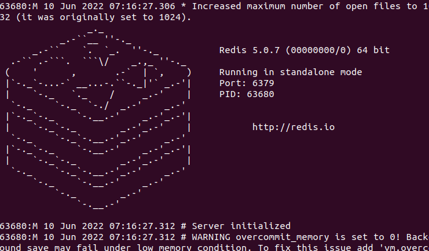

> ### 前言
>
> 大创的一些问题笔记

<!--more-->

### 环境配置for linux

1. ```
   sudo apt-get install nodejs
   ```

2. ```
   sudo apt install redis-server
   验证：redis-server
   结果如下
   关闭使用redis-cli shutdown
   如果杀死不了，则是开了保护进程，杀死一个就会再开一个，这时使用/etc/init.d/redis-server stop
   ```

   

3. 安装.NET Core,高版本兼容低版本，所以不必一定安装3.1

   [.NET 下载(Linux、macOS 和 Windows) (microsoft.com)](https://dotnet.microsoft.com/zh-cn/download/dotnet)

   ```
   wget https://packages.microsoft.com/config/ubuntu/22.04/packages-microsoft-prod.deb -O packages-microsoft-prod.deb
   sudo dpkg -i packages-microsoft-prod.deb
   rm packages-microsoft-prod.deb
   
   #注意那个22.04，看你的系统版本
   sudo apt-get update; \
     sudo apt-get install -y apt-transport-https && \
     sudo apt-get update && \
     sudo apt-get install -y dotnet-sdk-6.0
     
   ```

   


### aelf笔记

1. 运行

```run
# enter the Launcher folder and build 
cd chain/src/AElf.Boilerplate.Launcher/

# build
dotnet build

# run the node 
dotnet run --no-build bin/Debug/netcoreapp3.1/AElf.Boilerplate.Launcher

报错解决方法
When running Boilerplate, you might see some errors related to an incorrect password, to solve this, you need to backup your data-dir/keys/ folder and start with an empty keys folder. Once you’ve cleaned the keys, stop and restart the node with the dotnet run command shown above

关闭就直接关终端吧
官网上说的关掉方法在vscode里不管用

cd web/greeter
npm start
```

2. 运行测试

```code
cd ../../test/AElf.Contracts.HelloWorldContract.Tests/
dotnet test
官网上智障的缺了个s

输出：
Test Run Successful.
Total tests: 1
     Passed: 1
 Total time: 2.8865 Seconds
 
 实际tmd是汉语：
 正在启动测试执行，请稍候...
总共 1 个测试文件与指定模式相匹配。
已通过! - 失败:     0，通过:     1，已跳过:     0，总计:     1，持续时间: < 1 ms
```

3.code generator代码生成器

```json
/*Navigate to AElf.Boilerplate.CodeGenerator folder and open appsettings.json, modify Content node, tune New values as you wish*/
```

eg:

```code
# enter the Launcher folder and build 
cd chain/src/AElf.Boilerplate.CodeGenerator/

# build
dotnet build

# run the node 
dotnet run --no-build bin/Debug/netcoreapp3.1/AElf.Boilerplate.CodeGenerator
```

4. 合约部署contract deployment

   <!--好像很重要的样子-->自己去读吧

5. 创建一个合约

- **create the project**: generate the contract template using **AElf Boilerplate**’s code generator.
- **define the contract and its types**: the methods and types needed in your contract should be defined in a protobuf file, following typical protobuf syntax.

```
有一些protobuf讲解，下有链接，主要讲这个
```


- **generate the code**: build the project to generate the base contract code from the proto definition.
- **extend the generated code**: implement the logic of the contract methods.

[Smart contract implementation — AElf 0.6.0 documentation (aelf-boilerplate-docs.readthedocs.io)](https://aelf-boilerplate-docs.readthedocs.io/en/latest/demo/greeter.html)


6. 断言assert

```Assert
在觉得可能有问题的地方建议都加一句断言，方便debug
使用
Assert(!string.IsNullOrWhiteSpace(input.Value), "Invalid name.");
Assert(condition, "tips");
condition为false时将中止并输出，后面的提示字符串，tips要让人能看懂，不要写火星文
```

7.log

```log
Context.LogDebug(() => "Hello {0}!", input.Value);

It is also possible to log from smart contract methods. The above example will log “Hello” and the value of the input. It also prints useful information like the ID of the transaction. It will print in the console log if you launch the node with DEBUG mode. This is only for debug use and has no impacts on state at all.
```

8. front end前端

```front
前提：After you run Boilerplate, open another terminal at the repo’s root and navigate to the greeter project:

cd web/greeter
npm i
npm start
sdk:https://github.com/AElfProject/aelf-sdk.js
原文：https://docs.aelf.io/en/latest/getting-started/smart-contract-development/greeter-contract/front.html
```

9. 部署

直接上链接[Smart contract deployment — AElf release/1.0.0 documentation](https://docs.aelf.io/en/latest/getting-started/smart-contract-development/deployment.html)
