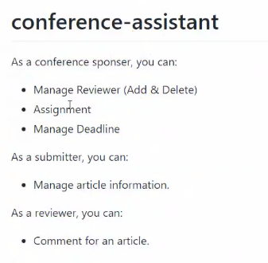

> ### summary
>
> 用于规划大创项目

<!--more-->

### 用户分类

可以按照如下示例进行分类，分为3类

- 发起人：发起评审者
- 提交者：提交项目用于评审
- 评审者：评审提交的项目

### 合约编写

#### 方法

| 方法名   | 参数 | 返回值 | 描述   |
| -------- | ---- | ------ | ------ |
| Initial  | null | null   | 初始化 |
| Register | null | null   | 注册   |
|          |      |        |        |

#### 数据结构

